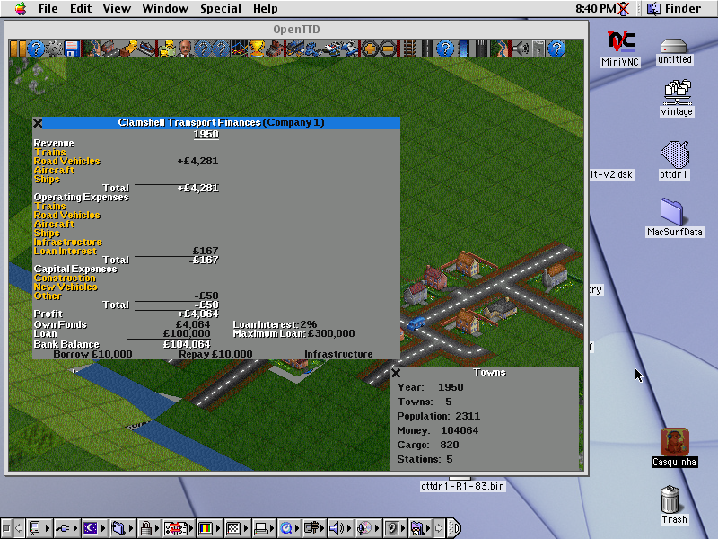
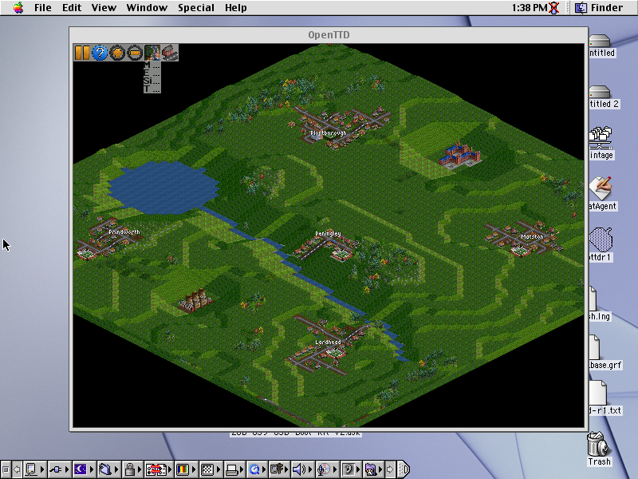
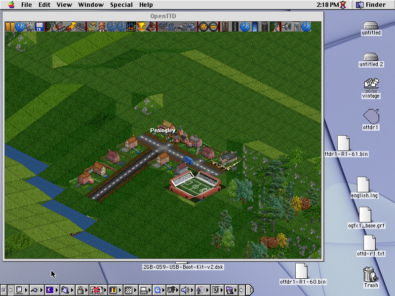
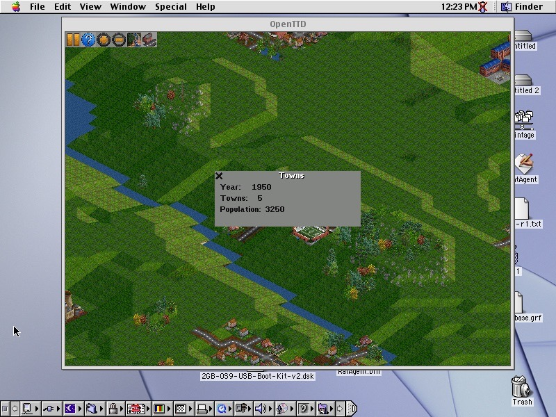
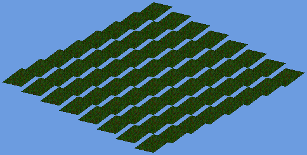
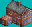

# OpenTTD on Mac OS 9 / PowerPC


An experimental port of [OpenTTD](https://www.openttd.org/) to **classic Mac OS 8/9 running on PowerPC**, built with the [Retro68](https://github.com/autc04/Retro68) cross-compiler toolchain.

This repository is the working scratch space for that port: a progression of small, individually bootable PPC applications that each prove one more piece of the game running on 25-year-old hardware — from a "hello world" up to the real OpenTTD engine simulating a growing town and the canonical game UI drawing itself, all in a single PowerPC binary.

> **Status:** experimental / research port. Everything described below has been confirmed on **real Mac OS 9 PowerPC hardware** (not just an emulator), unless noted otherwise. It is not a playable game yet — it's a milestone-driven journey toward one.

---

## What actually runs

The furthest-along build (`ottd-r1`) boots on Mac OS 9 / PPC and shows, all drawn by OpenTTD's *own* source (`viewport.cpp` / `window.cpp` / `widget.cpp` / `strings.cpp` / `toolbar_gui.cpp`):

- an organic value-noise world — hills, a lake, a river, forests, industries;
- **five towns growing live**, with real generated town names floating over them;
- a moving vehicle;
- the **full canonical OpenTTD toolbar** — real buttons, dropdown menus that open with real text;
- a draggable, closeable in-game window;
- a real player **company**, which lights up the build/finance/vehicle toolbar buttons.

Underneath, the real headless engine (`ottd-m1`) runs the genuine game loop: the calendar advances, a real `Town` lives in the real `TownPool`, OpenTTD's command dispatch executes real tile commands, and `GrowTown()` grows a town to 100+ houses with a real road network and population accounting.

---

## Screenshots

**Real Mac OS 9 / PowerPC hardware** — the `ottd-r1` build running on the actual machine (captured over VNC).

A real, moving economy: OpenTTD's own `CompanyFinancesWindow` — company "Clamshell Transport", pound-sterling balance, categorized revenue/expenses (loan interest, upkeep), max loan — over the live world, with a stats HUD (population, company money, industry cargo stockpile, stations). Real pooled `Company`, `Vehicle`, `Industry` and `Station` objects drive it, no fakes:



The full world with five live, named towns, a lake and a river, forests and industries — all rendered by OpenTTD's own `viewport.cpp` on PPC:



The canonical OpenTTD toolbar plus a zoomed-in town (Peningley) — houses, roads, a stadium, and autumn trees:



A draggable in-game "Towns" window, drawn by the real `window.cpp` / `widget.cpp` stack (Year 1950 · 5 towns · population 3250):



<details>
<summary><strong>Offline render-pipeline previews</strong> (host-side, used to debug geometry)</summary>

These are **not** hardware captures — they come from the Python render simulators in `agent-compositor/` and `agent-tiles/`, which reproduce the port's isometric tile math on the host so landscape geometry and sprite selection could be debugged without burning hardware round-trips.

Composited landscape scene (`agent-compositor/preview/scene.png`):



Individual tile sprites the renderer selects and projects (`agent-tiles/previews/`):

| Flat grass | Sloped grass | Water | Trees | Rocky |
|:---:|:---:|:---:|:---:|:---:|
|  |  |  |  |  |

</details>

---

## Subprojects

Each directory is a self-contained CMake application built for PowerPC. Roughly chronological:

| Directory | What it proves |
|---|---|
| `hello-ppc`, `hello-console` | Toolchain bring-up — first code running on PPC / Mac OS 9. |
| `ottd-thread-demo` | Cooperative threading model (`std::thread` shim over the Mac event loop). |
| `ottd-date-demo` | Real OpenTTD calendar/date math on PPC. |
| `ottd-fileprobe` | POSIX `opendir`/`readdir`/`stat` backed by the Mac File Manager. |
| `ottd-gfx-demo` | GRF sprite decode + the 8bpp blitter drawing real sprites. |
| `ottd-landscape` | Landscape / ground-sprite rendering. |
| `ottd-gamelogic` | Map + tile logic on the real data structures. |
| `ottd-b1`, `ottd-b1min` | **B1** — first full one-shot landscape render (`b1min` = minimal bisection variant used to isolate linker crashes). |
| `ottd-b2` | **B2** — a live `VideoDriver_MacClassic`: `WaitNextEvent` main loop, dirty-rect `CopyBits`, mouse pan/zoom/pick, plus the OS seams (sockets, dirents, cooperative sleep) and a permanent regression harness. |
| `ottd-m1` | **M1** — the real OpenTTD engine running **headless** on PPC: date ticks, real `Town` pool, command dispatch, tile commands, roads, and a town that grows. |
| `ottd-r1` | **R1** — the render merge: M1 engine + B2 video pipeline + the real OpenTTD window/UI stack + a real company, in one binary. The most complete build. |
| `agent-compositor`, `agent-tiles` | Offline Python tooling — render simulators (PIL) and tile-sprite generation used to debug geometry without burning hardware round-trips. |
| `compat` | The portability shims: `dirent.h`, `mac_sockets.h`, `libc_compat.h`, and cooperative `thread` / `mutex` / `condition_variable`. |

---

## OS seams

Porting to classic Mac OS meant re-implementing the POSIX/runtime surface OpenTTD assumes, on top of Toolbox and Open Transport. Status:

- **Video** ✅ — `VideoDriver_MacClassic` (`WaitNextEvent` + dirty-rect `CopyBits`, palette animation).
- **File system** ✅ — `opendir`/`readdir`/`stat` via the File Manager (`PBGetCatInfo`).
- **UDP sockets** ✅ — BSD `sendto`/`recvfrom` over Open Transport.
- **TCP sockets** ✅ — non-blocking `connect`/`send` and `listen`/`accept`/`recv` over Open Transport (client + server, loopback-proven).
- **Cooperative runtime** ✅ — `sleep_for` yields the CPU back to Mac OS via the event pump; condition-variable pumping still partial.

A regression harness in `ottd-b2` re-runs the socket seam tests on every launch and reports one greppable verdict line each.

---

## Building & deploying

Prerequisites: the [Retro68](https://github.com/autc04/Retro68) toolchain (built for `powerpc-apple-macos`) and its Open Transport SDK. The toolchain itself is **not** vendored here (see `.gitignore`).

Each subproject builds with CMake against the Retro68 toolchain file, e.g.:

```sh
cd ottd-m1
cmake -B build -DCMAKE_TOOLCHAIN_FILE=<retro68>/powerpc-apple-macos/cmake/retroppc.toolchain.cmake .
cmake --build build --target ottdm1_APPL
```

This produces a MacBinary (`.bin`) / PEF `.APPL` you copy to the Mac and decode. The larger builds (`ottd-m1`, `ottd-r1`) use a `build.sh` to hand-compile the real OpenTTD translation units into `obj/` first, with the port's merge flags, before the CMake link step. Runtime logging goes out over the UDP socket seam to a network log sink.

The checked-in deployable binaries (`*.APPL`, `*.pef`, `*.bin`, `*.ad`) are the actual artifacts that ran on hardware. Regenerable intermediates (`*.xcoff`, `*.o`, …) are git-ignored.

---

## Toolchain notes (the hard-won part)

A sampling of the Retro68 / XCOFF-PPC landmines this port had to work around — the reusable gold:

- **`--gc-sections` is a no-op** in this binutils XCOFF linker. Every compiled translation unit links *whole*, so pulling in one real OpenTTD `.cpp` drags its entire undefined-symbol surface. Bounding each unit with header-matched no-op stubs is mandatory, not optional.
- **Duplicate symbols crash `ld` (SIGSEGV) instead of erroring cleanly.** "Silent linker crash" almost always means a `multiple definition` between a real TU and a stub — dedup with `#ifndef` guards.
- **`dynamic_cast` on a real polymorphic object bus-errors** — RTTI is broken on Retro68/XCOFF PPC. Replaced with `static_cast` where the type is known and hand-written virtual `As*()` downcast helpers where the parser needs null-on-mismatch.
- **`std::chrono::steady_clock` is broken** — swapped for a `TickCount()`-based clock.
- **Bare `assert()` aborts silently** on Mac (no message reaches the log). A valid-looking op that just *stops* is usually a tripped assert — build with `-DNDEBUG` for release paths.
- **Zeroed "deadpool" globals silently disable real code paths.** When a real flag won't fire, suspect an upstream `_settings_*==0` guard sitting in zeroed storage.

The `agent-*` Python simulators exist precisely because hardware round-trips are expensive — reproducing render/geometry bugs offline (via the real coordinate math) pointed straight at fixes without repeated deploys.

---

## Licensing

This repository is licensed under the **GNU General Public License, version 2** (see [`LICENSE`](LICENSE)).

It is a **port of, and derivative work based on, [OpenTTD](https://www.openttd.org/)** — which is itself GPL v2. This project compiles OpenTTD translation units, adapts OpenTTD source into its shim/scene files, and links OpenTTD code into every deployable binary (`*.APPL`, `*.pef`, `*.bin`). Because the whole is a work based on the Program, GPL v2 governs the whole, and the port code is offered under the same terms. There is no proprietary or permissively-licensed carve-out.

Attribution for OpenTTD and the Retro68 toolchain is in [`NOTICE`](NOTICE).

## Credits

- [OpenTTD](https://www.openttd.org/) — the open-source Transport Tycoon Deluxe reimplementation being ported (GPL v2).
- [Retro68](https://github.com/autc04/Retro68) — the GCC cross-compiler and runtime for classic 68k/PowerPC Mac OS that makes this possible.
